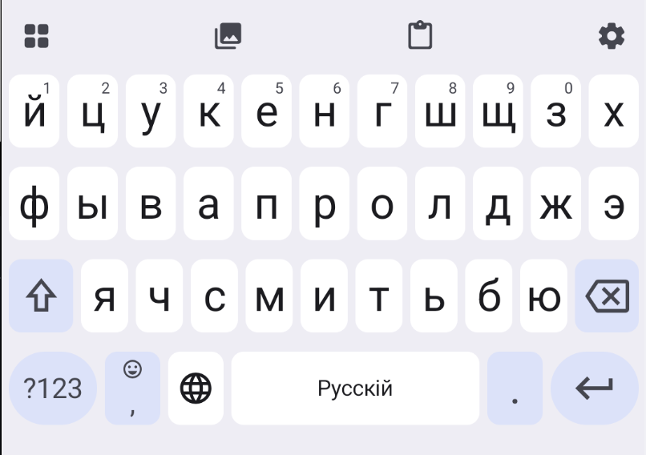

# Ижица

«Ижица» — клавиатура для Android с буквами русской дореформенной орфографии.
Она подходит для набора исторических текстов и при этом остаётся обычной
современной клавиатурой для повседневного ввода.

<p align="center">
  
</p>

## Возможности

- русская раскладка с буквами ѣ, ѳ, і и ѵ;
- твёрдый знак ъ, дореформенные буквы и гласные с ударением по долгому нажатию;
- английская, символьные и цифровая раскладки;
- подсказки из встроенного русского словаря;
- панели эмодзи, дореформенных стикеров и буфера обмена;
- светлое и тёмное оформление;
- настраиваемые звук и вибрация клавиш;
- справочник дореформенного алфавита;
- дореформенная орфография в интерфейсе приложения.

Дореформенные буквы доступны по долгому нажатию клавиш `е`, `ф` и `и`.
Твёрдый знак открывается долгим нажатием `ь`.

## Установка

<a href='https://play.google.com/store/apps/details?id=software.kanunnikoff.izhitsa&pcampaignid=pcampaignidMKT-Other-global-all-co-prtnr-py-PartBadge-Mar2515-1'></a>

После установки откройте «Ижицу» и выполните показанные в приложении шаги:

1. разрешите клавиатуру в системных настройках;
2. выберите «Ижицу» текущим методом ввода;
3. проверьте ввод в расположенном на главном экране текстовом поле.

Приложению требуется Android 8.0 (API 26) или новее.

## Сборка

Для сборки нужны JDK 17 и Android SDK 37. Откройте проект в Android Studio
либо выполните из корня репозитория:

```shell
./gradlew :app:assembleDebug
```

Локальные модульные проверки запускаются командой:

```shell
./gradlew :app:testDebugUnitTest
```

## Устройство проекта

- `app/src/main/java/software/kanunnikoff/izhitsa/SoftKeyboard.kt` — служба
  метода ввода и управление состоянием клавиатуры;
- `app/src/main/java/software/kanunnikoff/izhitsa/compose` — раскладки и
  интерфейс клавиатуры;
- `app/src/main/java/software/kanunnikoff/izhitsa/ui` — приложение-компаньон,
  справка и настройки;
- `app/src/main/assets/russian.bin` — встроенный двоичный словарь;
- `Tools/DictionaryCompiler.java` — утилита сборки двоичного словаря;
- `GooglePlayAssets/2.0.0` — готовые материалы и сценарии их сборки для
  страницы приложения в Google Play.

## Лицензия

Исходный код распространяется на условиях [MIT License](LICENCE).
